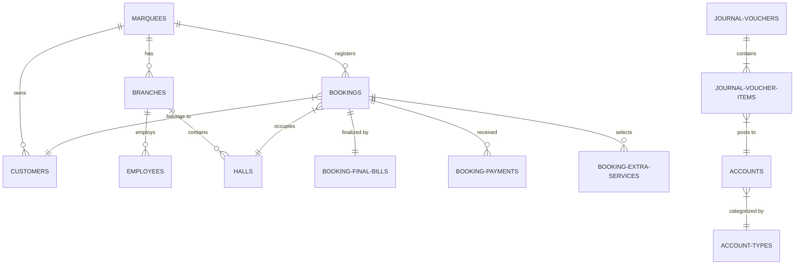

# Database Documentation — MarqueeCMS

This document details the database schema, entity-relationship logical structures, naming inconsistencies, and normalization/indexing recommendations for MarqueeCMS.

---

## 1. Core Database Entity Definitions

The platform utilizes a structured relational database consisting of 42 tables, segregated by functional domains.

### 1.1 SaaS & Tenant Module
* **`subscription_plans`**: Defines membership tiers (Standard, Premium, Enterprise).
* **`marquees`**: The master Tenant table representing individual banquet businesses.
* **`branches`**: Sub-tenant branch venues. Includes tax integration settings.

### 1.2 Access Control & Staff
* **`roles`**: System roles (e.g. `super_admin`, `owner`, `branch_manager`, `accountant`, `booking_officer`).
* **`permissions`**: Access tags (e.g. `view_bookings`, `manage_accounting`).
* **`permission_role`**: Pivot mapping roles to permissions.
* **`employees`**: Personal and payroll records for staff.
* **`users`**: CMS login credentials mapped to roles and employees.

### 1.3 Booking & Catering Operations
* **`halls`**: Event halls / physical venues.
* **`slots`**: Shifts (e.g. Morning, Afternoon, Evening timings).
* **`hall_slots`**: Predefined active slots for each hall.
* **`bookings`**: Central operational transactional records. Contains timelines, totals, status flags.
* **`booking_halls`**: Pivot table allowing multi-hall bookings.
* **`booking_menu_items`**: Custom dish choices per booking.
* **`booking_extra_services`**: Addons selected for a booking.
* **`booking_payments`**: Financial payment installments from customers.
* **`booking_final_bills`**: Final actual cost adjustments prepared on event day.

### 1.4 Double-Entry Financial Accounting
* **`financial_years`**: Active fiscal calendar limits.
* **`account_types`**: Main classifications (Assets, Liabilities, Equity, Revenue, Expenses).
* **`accounts`**: Chart of accounts codes and descriptions.
* **`account_opening_balances`**: Opening values of accounts per financial year and branch.
* **`journal_vouchers`**: General ledger voucher headers.
* **`journal_voucher_items`**: Dual entries showing matching debits and credits.
* **`cash_bank_accounts`**: Bank ledger registers.

### 1.5 Inventory & Purchasing
* **`inventory_items`**: Material catalog (stock quantities, avg costs, reorder levels).
* **`suppliers` & `supplier_ledgers`**: Vendor listings and transactional balances.
* **`purchase_orders`**: Material PO headers.
* **`goods_receiving_notes` (GRN)**: Logs of physically received goods.
* **`purchase_invoices` & `purchase_returns`**: Financial vendor invoices and credit notes.

### 1.6 Operational Expenses
* **`expenses` & `expense_items`**: Outflow logs.
* **`petty_cash_accounts`**: Disbursed cash registers.
* **`expense_budgets`**: Expense thresholds.
* **`recurring_expenses`**: Cron-generated bills (rent, salary, etc.).

---

## 2. Entity-Relationship Summary

---

## 3. Naming Inconsistencies & Technical Debt

During the database audit, several schema inconsistencies and naming debts were identified. These should be standardized in subsequent schema refactoring:

### 3.1 Creator & User Foreign Key Column Inconsistencies
* In `bookings` and `customers` tables, the user who created the record is named **`created_by`** (linked to `users.id`).
* In `booking_payments`, the collector is named **`received_by`**.
* In `booking_final_bills`, the final accountant is named **`prepared_by`**.
* In `expenses`, the columns are named **`created_by_user_id`** and **`approved_by_user_id`** instead of `created_by` and `approved_by`.
* In `petty_cash_accounts`, the custodian column is named **`custodian_user_id`**.
* In `petty_cash_reconciliations`, the auditor column is named **`reconciled_by_user_id`**.

*Standardization Recommendation*: Reformat user reference columns to either consistently use suffix `_by` (e.g., `created_by`, `approved_by`) or `_user_id` (e.g., `created_by_user_id`) to avoid helper mapping failures.

### 3.2 Status Value Case Discrepancies
The values for system statuses are inconsistent across tables, which can introduce silent bugs in queries:
* **`Active`/`Inactive`/`Blocked`** (Pascal Case): Used in `customers`, `menu_categories`, `menu_items`, `branches`, `extra_services`.
* **`active`/`inactive`/`suspended`** (Lowercase): Used in `marquees`, `slots`, `expense_categories`, `expense_types`, `recurring_expenses`.
* **`Draft`/`Reserved`/`Confirmed`/`Cancelled`** (Title Case): Used in `bookings`.
* **`draft`/`posted`** (Lowercase): Used in `journal_vouchers`.

*Standardization Recommendation*: Adopt a unified casing convention (e.g., all lowercase `active`/`inactive`) at the database constraint level.

---

## 4. Index Optimization & Recommendations

The following tables lack critical performance indexes, which will result in queries slowing down as transaction logs grow:

### 4.1 Missing Key Database Indexes
1. **`journal_voucher_items`**:
   - *Current*: Only has primary key and foreign key constraint.
   - *Recommendation*: Add a compound index on `[account_id, journal_voucher_id]` to optimize general ledger queries.
2. **`supplier_ledgers`**:
   - *Current*: Index on polymorphic reference `[reference_type, reference_id]`.
   - *Recommendation*: Add index on `[supplier_id, transaction_date]` to prevent N+1 and slow queries on supplier balance check histories.
3. **`bookings`**:
   - *Current*: Indexes on `[marquee_id, hall_id, booking_status]`, `[start_time, end_time]`, and `[booking_date]`.
   - *Recommendation*: Add an index on `[customer_id]` to speed up CRM total booking count queries.
4. **`accounts`**:
   - *Current*: No indexes on scoping keys.
   - *Recommendation*: Add index on `[marquee_id, account_code]` to quicken lookup codes during transactions posting.

---

## 5. Normalization Opportunities
* **`booking_final_bills` & `booking_final_bill_extra_services`**:
  - The final bill replicates many fields from the original booking table (e.g., `final_guest_count`, `final_package_amount`, `final_tax_amount`). This is acceptable to record the final event-day state separately from the initial booking, but it leads to redundancy.
  - *Recommendation*: Explicitly document the audit trail separation between original booking settings and final adjustments.
