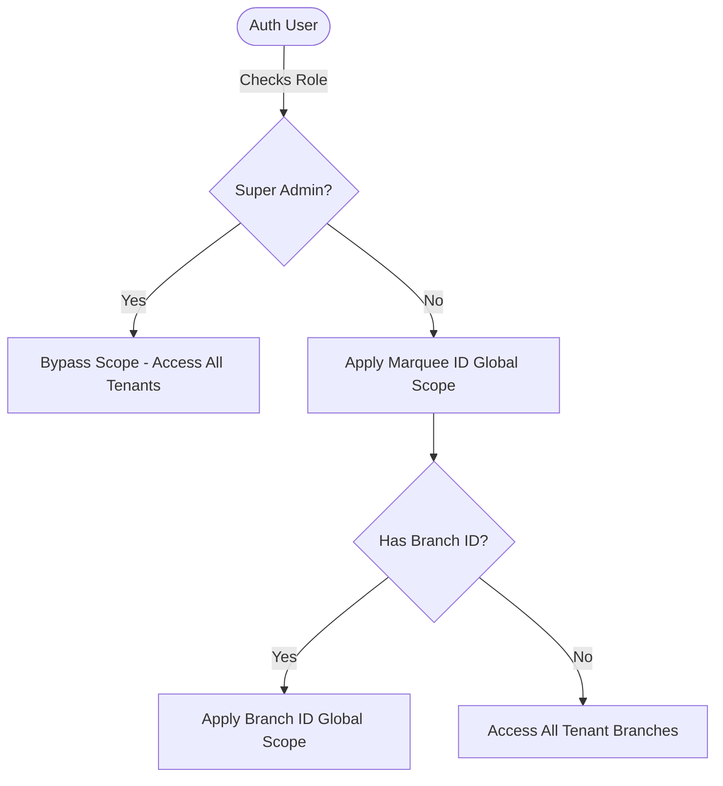

# Project Overview — MarqueeCMS

## 1. Executive Summary
**MarqueeCMS** is a comprehensive, enterprise-grade multi-tenant Banquet & Marriage Hall Management SaaS platform. It enables event venue owners and administrators to manage physical halls, slot schedules, customer CRM records, custom event menus & packages, bookkeeping invoices, double-entry financial accounting, purchase orders, inventory stocks, and branch-level operating expenses in a single, integrated platform. 

The software targets the event and hospitality industry, primarily in Pakistan (regional tax structure support: PRA, SRB, FBR), offering robust multi-tenant and branch-level data isolation.

---

## 2. System Architecture

MarqueeCMS is built as a single-database multi-tenant SaaS application, emphasizing tenant (Marquee) and sub-tenant (Branch) level data isolation.

### 2.1 Multi-Tenant Isolation
Tenant isolation is enforced dynamically at the database query level via Eloquent Global Scopes:
- **`BelongsToTenant` Trait**: Applied to all tenant-specific models (e.g., `User`, `Customer`, `Booking`, `Account`, `InventoryItem`). Upon booting, this trait automatically registers a `tenant` global scope.
- **Scope Rule**: When a user queries a model, the scope automatically appends `where('marquee_id', auth()->user()->marquee_id)`. During record creation, it auto-assigns `marquee_id = auth()->user()->marquee_id`.
- **Bypass Rule**: SaaS Super Admins (`isSuperAdmin()`) bypass this scope to allow cross-tenant analytics and subscription management.

### 2.2 Branch Isolation
For multi-branch venues, branch-level scope isolation restricts managers and booking officers to their respective branch data:
- **`BelongsToBranch` Trait**: Applied to branch-specific records (e.g., `Booking`, `Expense`, `PurchaseOrder`, `PettyCashAccount`).
- **Scope Rule**: Filters queries by `branch_id` matching the authenticated user's `branch_id`.



### 2.3 Access Control & Authorization
Instead of third-party libraries (such as Spatie Laravel Permission), MarqueeCMS utilizes a lightweight, custom-implemented **RBAC (Role-Based Access Control)** system:
- **Models**: [Role](file:///c:/wamp64/www/MarqueeCMS/app/Models/Role.php) and [Permission](file:///c:/wamp64/www/MarqueeCMS/app/Models/Permission.php) linked via a standard `permission_role` pivot table.
- **User Gateways**:
  - `User::isSuperAdmin()`: Checks if the user's role is `super_admin`.
  - `User::hasRole($role)`: Checks user's role assignment.
  - `User::hasPermission($permission)`: Evaluates permissions linked to the user's role. Super Admins and Owner roles default to `true` for all permission checks.

---

## 3. Technology Stack

* **Core Framework**: Laravel 12.x
* **Language**: PHP 8.2+
* **Reactive Frontend**: Livewire 3.x, Alpine.js
* **UI styling**: Bootstrap 5.x & Falcon Admin Theme
* **Database**: MySQL 8.x / SQLite (testing)
* **Reporting Engine**: DomPDF for PDF invoice and slip streaming
* **Asset Bundling**: Vite 5.x

---

## 4. Folder Structure

The directory structure follows standard Laravel conventions, with service and trait extensions:

```
MarqueeCMS/
├── app/
│   ├── Http/
│   │   ├── Controllers/       # Resource Controllers (SaaS invoicing, routing)
│   │   └── Middleware/        # Authentication & Role restrictions
│   ├── Livewire/              # Interactive components (booking, billing, ledger)
│   ├── Models/                # Eloquent Models (66 active entities)
│   ├── Notifications/         # Tenant alerts & event schedules
│   ├── Repositories/          # Data Access Layers (e.g. Expense repository)
│   ├── Services/              # Domain Core Logic (Accounting, Pricing, Purchases)
│   └── Traits/                # Tenant & Branch scoping traits
├── config/                    # Global Configuration settings
├── database/
│   ├── migrations/            # 42 database migrations mapping ERP relations
│   └── seeders/               # 13 seeders setting up plans, charts of accounts, items
├── docs/                      # Technical documentation files
├── resources/
│   ├── views/
│   │   ├── layouts/           # Admin & Auth Falcon structures
│   │   ├── livewire/          # UI blades for Livewire components
│   │   └── bookings/          # Printable invoices & PDF layouts
├── routes/
│   ├── web.php                # Authentication, operations, financial routes
│   └── console.php            # Automated daily utility checks (recurring expenses)
└── tests/
    ├── Feature/               # 15 feature test files covering operations
    └── Unit/                  # Business logic unit checks
```

---

## 5. Environment Requirements

To run this application, ensure your environment meets the following specifications:

- **PHP Version**: `^8.2`
- **Database System**: MySQL `^8.0` (locally or via phpMyAdmin/Wampserver)
- **Extensions Needed**:
  - `BCMath` (for double-entry precise values)
  - `GD` or `Imagick` (for document uploads and profile photos)
  - `PDO_MySQL`
  - `XML` / `MBString`
- **Node.js**: `^18.x` or `^20.x` (for frontend building)
- **Composer**: `^2.5`

---

## 6. Coding Standards & Conventions

1. **Service Layer**: Keep controllers and Livewire components lean. Core business rules (like voucher balance verification, availability collision checks, and pricing calculation) must reside in the `app/Services` folder.
2. **Double-Entry Accuracy**: Financial values, rates, discounts, and tax amounts must be stored as `decimal(15,2)` in database migrations and cast to `float` or handled precisely to prevent rounding losses.
3. **Scoping Requirement**: Every model representing tenant data MUST implement `use BelongsToTenant;`. Models representing branch operations must implement `use BelongsToBranch;`.
4. **Soft Deletes**: Soft deletes are enforced on transactional models (e.g. bookings, purchase invoices, suppliers) to preserve financial trails and system history.
5. **No Placeholders**: Never implement dummy data outputs or static charts on live operation views. Dynamic properties must sync with backend counts.
