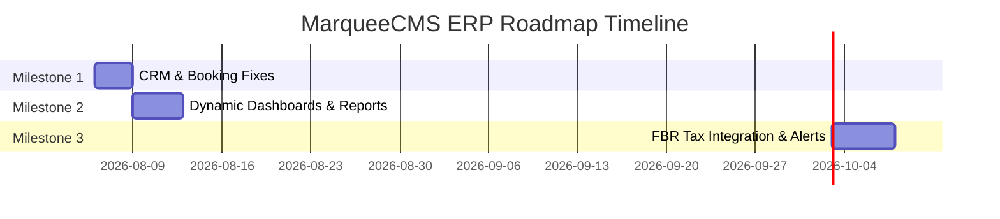

# Gap Analysis & Implementation Roadmap — MarqueeCMS

This document compares MarqueeCMS against standard enterprise ERP platforms, identifies functional gaps, and structures the remaining development tasks into prioritized milestones.

---

## 1. Gap Analysis

Comparing MarqueeCMS's current features against a full banquet ERP solution:

| Module / Feature Area | Enterprise ERP Standard | MarqueeCMS Status | Gap Classification | Priority |
| :--- | :--- | :--- | :--- | :--- |
| **CRM & Referrals** | Searchable referral names, automated referral payouts tracker, and revenue reports per referral. | Partially implemented. Referral fields exist in DB but are not searchable or reportable. | Missing CRM referral report and search filters. | **High** |
| **Customer List** | Instant overview of customer value (total bookings count and outstanding ledger balance). | Partially implemented. Dynamic attributes exist in model but are omitted from UI list table. | Missing "Total Bookings" column in UI. | **High** |
| **Booking Slip (V2)** | Event details, venue timing, guests count, menu rates, and contact details properly partitioned. | Partially implemented. Inconsistent layout structure, missing fields, and email showing. | Layout formatting issues. | **High** |
| **Conflict Checker** | Option to lock entire venue for a slot, preventing other halls from being booked for concurrent events. | Partially implemented. Checks availability only per individual hall. | Missing venue-wide slot conflict option. | **High** |
| **Catering Menu Editor** | Custom ordering/sorting of menu items on the event slip. | Not started. Dishes are printed in database order. | Missing custom sequence ordering tool. | **Medium** |
| **FBR POS Integration** | Real-time transmission of invoice data to Pakistan tax authorities (FBR, PRA, SRB). | Not started. Fields exist in Branch model, but integration client is missing. | Missing API Tax Integration. | **Critical** (For Compliance) |
| **Financial Reporting** | Auto-generation of Balance Sheet and Profit & Loss Statements. | Not started. Ledger is double-entry but reports are missing. | Missing standard financial reports. | **Critical** (For Accounting) |
| **Dynamic Dashboard** | Live stats (total bookings, active halls, packages, revenue metrics). | Not started. Dashboard statistics are hardcoded static figures. | Mockup placeholder dashboard. | **Medium** |

---

## 2. Prioritized Roadmap & Milestones

To complete the MarqueeCMS ERP suite, we group the pending tasks into three main implementation milestones.

### Milestone 1: CRM & Booking Operational Fixes
*Goal*: Resolve layout discrepancies, complete search capabilities, and enforce slot assignment constraints.
* **Task CRM-01**: Add "Total Bookings" column in Customer List UI.
  - *Complexity*: Low | *Est. Time*: 1 hour | *Dependencies*: None
* **Task CRM-02**: Integrate Referrer name search into Customer Management.
  - *Complexity*: Low | *Est. Time*: 2 hours | *Dependencies*: None
* **Task BKG-01**: Re-layout Booking Slip (V2) according to requirements (Move Event Type and Qty/Guests to venue timings, move Rate to bottom left, remove email).
  - *Complexity*: Medium | *Est. Time*: 4 hours | *Dependencies*: None
* **Task BKG-02**: Implement slot conflict check across all halls (Venue-wide lock).
  - *Complexity*: Medium | *Est. Time*: 3 hours | *Dependencies*: None
* **Task BKG-03**: Add drag-and-drop or sequence sorting index customisation for catering items on slips.
  - *Complexity*: Medium | *Est. Time*: 5 hours | *Dependencies*: None

### Milestone 2: Accounting Reports & Live Analytics
*Goal*: Replace static dashboards with live metrics and generate double-entry financial summaries.
* **Task FIN-01**: Replace hardcoded values on main Dashboard with dynamic database query averages.
  - *Complexity*: Low | *Est. Time*: 3 hours | *Dependencies*: None
* **Task ACC-01**: Develop Profit & Loss Statement report.
  - *Complexity*: High | *Est. Time*: 8 hours | *Dependencies*: `AccountingService`
* **Task ACC-02**: Develop Balance Sheet report.
  - *Complexity*: High | *Est. Time*: 8 hours | *Dependencies*: `AccountingService`
* **Task CRM-03**: Create CRM referral reports screen tracking booking counts and revenue generated by referrers.
  - *Complexity*: Medium | *Est. Time*: 4 hours | *Dependencies*: None

### Milestone 3: Tax Authority Integrations & Automations
*Goal*: Ensure regulatory compliance and automate client-facing communications.
* **Task INT-01**: Build FBR POS integration API sync worker.
  - *Complexity*: High | *Est. Time*: 12 hours | *Dependencies*: `Branch` configuration keys
* **Task SYS-01**: Implement SMS / WhatsApp / Email alert triggers for booking statuses.
  - *Complexity*: Medium | *Est. Time*: 6 hours | *Dependencies*: `bookings`

### Milestone 4: SaaS Stripe Billing & Multi-Currency Support
*Goal*: Enable global subscription management, multi-currency plan configurations, and Stripe online payments.
* **Task BIL-01**: Implement Multi-Currency plan pricing.
  - *Complexity*: Medium | *Est. Time*: 4 hours | *Dependencies*: None
* **Task BIL-02**: Integrate Stripe Checkout session and callback verified signature logic.
  - *Complexity*: High | *Est. Time*: 10 hours | *Dependencies*: None
* **Task BIL-03**: Create Tenant self-service Billing Dashboard portal.
  - *Complexity*: High | *Est. Time*: 6 hours | *Dependencies*: None

### Milestone 5: Initial Business Configuration Wizard
*Goal*: Prevent operational inconsistencies through forced onboarding wizard for new tenants.
* **Task WIZ-01**: Create multi-step wizard component capturing Marquee, Branch, and Hall configurations.
  - *Complexity*: High | *Est. Time*: 12 hours | *Dependencies*: None
* **Task WIZ-02**: Build EnsureInitialSetupIsCompleted middleware locking other modules.
  - *Complexity*: Medium | *Est. Time*: 4 hours | *Dependencies*: None
* **Task WIZ-03**: Integrate dashboard progress checklists with interactive step redirect anchors.
  - *Complexity*: Medium | *Est. Time*: 4 hours | *Dependencies*: None
