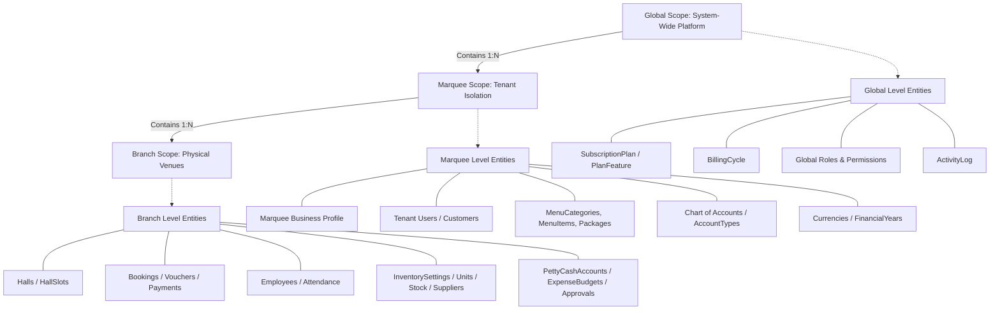

# Architectural Scope Analysis Report: MarqueeCMS

This document details the data visibility and isolation architecture of MarqueeCMS. It outlines how models, database tables, and user actions are partitioned across **Global**, **Marquee (Tenant)**, and **Branch** levels.

---

## 1. Scope Level Hierarchy



---

## 2. Classification Matrix

Below is a complete classification of the application's models categorized by their operational and structural scopes:

| Scope Level | Purpose / Characteristics | Models |
| :--- | :--- | :--- |
| **Global Level** | Shared across the entire SaaS instance. Records do not possess a `marquee_id` column. Managed strictly by Super Admins. | - `SubscriptionPlan`<br>- `PlanFeature`<br>- `BillingCycle`<br>- `Role` & `Permission` (System templates)<br>- `ActivityLog` |
| **Marquee Level** | Tenant-scoped data isolated using the `BelongsToTenant` trait. Applied dynamically based on the authenticated user's `marquee_id` context. | - `Marquee` (Business profiles)<br>- `Branch` (Listing structures)<br>- `User` (CMS login identities)<br>- `Customer` & `CustomerDocument`<br>- `CustomerCommunicationLog`<br>- `EventType` (Customizable per marquee)<br>- `MenuCategory` & `MenuItem`<br>- `Package` (Event pricing packages)<br>- `Account` & `AccountType` (Double-entry COA)<br>- `FinancialYear`<br>- `Currency` (Localized rates)<br>- `Supplier` & `SupplierLedger`<br>- `SaasPayment` & `SaasInvoice` |
| **Branch Level** | Physical venue data isolated using the `BelongsToBranch` trait. Filters queries by `branch_id` when the user has a restricted branch identity. | - `Hall` & `HallSlot` (Halls & calendar schedules)<br>- `Slot` (Shift hours)<br>- `Booking` & `BookingMenuItem` & `BookingExtraService`<br>- `BookingFinalBill` & `BookingPayment`<br>- `Employee` (Branch payroll & personnel)<br>- `InventorySetting` & `InventoryUnit` & `InventoryCategory`<br>- `InventoryItem` (Stock ledgers)<br>- `GoodsReceivingNote` & `GoodsReceivingNoteDetail`<br>- `PurchaseOrder` & `PurchaseOrderDetail`<br>- `PurchaseInvoice` & `PurchaseInvoiceDetail`<br>- `PurchaseReturn` & `PurchaseReturnDetail`<br>- `PettyCashAccount` & `PettyCashReconciliation`<br>- `Expense` & `ExpenseItem` & `ExpenseApproval`<br>- `ExpenseApprovalRule` & `ExpenseBudget` |

---

## 3. Data Isolation Mechanics

### A. Marquee (Tenant) Level Isolation
Implemented via the `BelongsToTenant` trait, which utilizes Laravel's Eloquent lifecycle events:
- **Write Path**: Intercepts the `creating` event to automatically populate the `marquee_id` based on the authenticated user's profile:
  ```php
  static::creating(function ($model) {
      if (Auth::check() && ! $model->marquee_id) {
          $model->marquee_id = Auth::user()->marquee_id;
      }
  });
  ```
- **Read Path**: Mounts a global query scope (`tenant`) that filters queries at database level. It enforces `where marquee_id = user->marquee_id` for all non-super-admin sessions.

### B. Branch Level Isolation
Implemented via the `BelongsToBranch` trait:
- **Write Path**: Sets the `branch_id` automatically from the user's active branch profile upon creation.
- **Read Path**: Mounts a global scope (`branch`). If the logged-in user belongs to a specific branch (e.g. a Branch Manager, Accountant, Receptionist) and is not a Super Admin, it isolates all query results to `branch_id = user->branch_id`. Owners who manage multiple branches can clear this scope (`withoutGlobalScope('branch')`) to consolidate records.

---

## 4. User Role Scopes

Roles define administrative access boundaries across the levels:

1. **Super Admin (Global Scope)**
   - Bypasses both `tenant` and `branch` global scopes.
   - Accesses all tables, system configurations, subscription plans, platform-wide metrics, and audit logs.
2. **Owner (Marquee / Tenant Scope)**
   - Restrained to a single `marquee_id`.
   - Bypasses `branch_id` constraints (i.e. has `branch_id = null` or selection clearance), allowing cross-branch consolidations.
   - Can view the entire company's ledger, create new branches, allocate budgets, adjust approval thresholds, and subscribe to plans.
3. **Branch Manager (Branch Scope)**
   - Bound to a specific `marquee_id` and a single `branch_id`.
   - Manages bookings, inventory items, local employee files, and petty cash reconciliations for their branch only.
4. **Accountant (Marquee / Branch Scope)**
   - Performs book-keeping, expense tracking, and invoicing.
   - Typically has access across branches if managing centralized finance, or restricted to a single branch context.
5. **Staff / Receptionist / Storekeeper (Restricted Branch Scope)**
   - Limited strictly to operational interfaces (e.g. creating raw bookings, issuing stock items, or raising petty cash requests).
